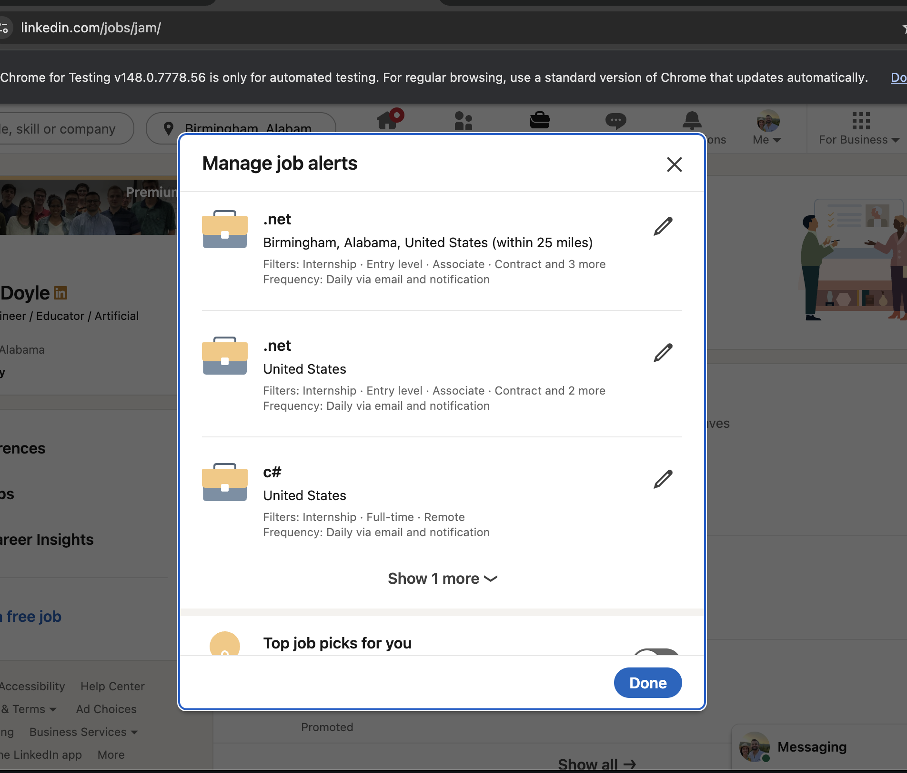

# LinkedIn Job Search Skills

A shareable bundle of Claude skills for running standardized LinkedIn job searches through the Claude Code Chrome extension:
https://chromewebstore.google.com/detail/claude/fcoeoabgfenejglbffodgkkbkcdhcgfn

## Skills Included

| Skill | Purpose |
|---|---|
| `linkedin-job-search-router` | Routes natural-language job search requests to the right saved C# / .NET search configuration. |
| `linkedin-csharp-job-search` | Remote C# Entry/Associate, Full-time, Past 24h. |
| `linkedin-csharp-internship-search` | Remote C# Internship, Full-time, Past 24h. |
| `linkedin-dotnet-job-search` | Remote .NET Internship+Entry+Associate, Full-time+Contract, Past 24h. |
| `linkedin-local-dotnet-search` | Local .NET, On-site+Hybrid, Past week. Default home town is Birmingham, AL (`geoId=102905961`). |

## Requirements

- Claude with skill support.
- Claude Code Chrome extension installed.
- An authenticated LinkedIn session in the active Chrome profile.

## Install

From this package directory:

```bash
./install.sh
```

By default, this copies the skills into `~/.claude/skills/`.

Optional targets:

```bash
./install.sh --project        # ./.claude/skills/
./install.sh --cursor-user    # ~/.cursor/skills/
./install.sh --cursor-project # ./.cursor/skills/
```

Restart Claude Code after installing so it picks up the new skills.

## Manual Install

Copy each skill folder into one of these locations:

- User-global Claude skills: `~/.claude/skills/`
- Project-scoped Claude skills: `<project>/.claude/skills/`
- User-global Cursor skills: `~/.cursor/skills/`
- Project-scoped Cursor skills: `<project>/.cursor/skills/`

## Shared Conventions

- Each skill checks `https://www.linkedin.com/jobs/jam/` before creating an alert.
- Each skill toggles **Set alert** after running unless an equivalent alert already exists.
- The router can run a full sweep across all four leaf searches and dedupe by job ID.
- Home-town location is owned by `linkedin-local-dotnet-search`; update that skill's `geoId` block if the user moves.

## Customization

To change the local market, edit `linkedin-local-dotnet-search/SKILL.md`:

- `geoId`
- location name
- optional `distance`

LinkedIn `geoId` is authoritative. Avoid relying only on the visible location text field.

## Reviewing Your Alerts

You can see every alert currently set on your LinkedIn profile at [linkedin.com/jobs/jam](https://www.linkedin.com/jobs/jam/). The **Manage job alerts** dialog lists each saved search with its location, filters, and email/notification frequency, and lets you edit or delete them. Useful for confirming a skill set the alert you expected, or for cleaning up duplicates.


